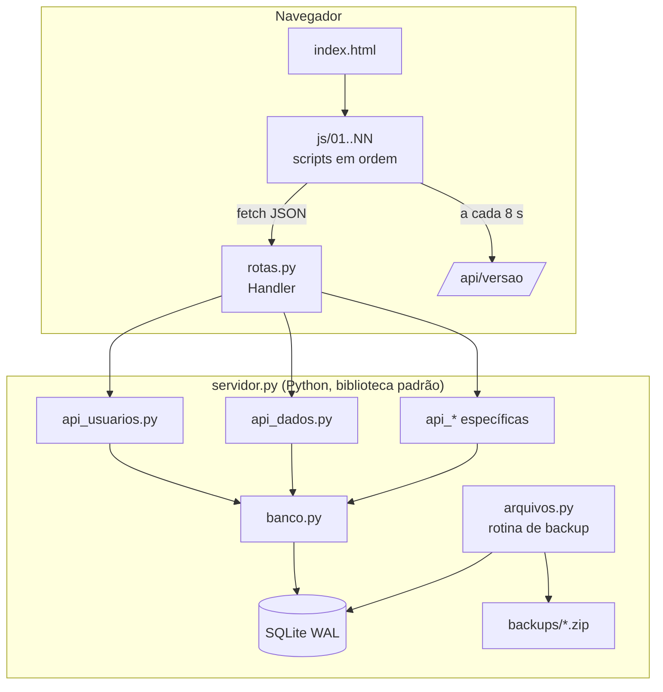

# Arquitetura

Este documento descreve como o Controle de Notificações é organizado por dentro.

## Visão geral



### Princípios

| Decisão | Motivo |
|---|---|
| **Só biblioteca padrão do Python** | Instalação em um passo, nada para atualizar, menos superfície de ataque. |
| **SQLite em modo WAL** | Um arquivo só, sem servidor de banco, leituras simultâneas sem bloquear. |
| **Uma gravação por vez** (`TRAVA`, um `threading.Lock`) | Elimina condições de corrida; o volume de escrita é baixo (uso humano). |
| **Frontend sem framework** | Sem etapa de build: o que está em `static/` é exatamente o que roda. |
| **Dados completos em `/api/dados`** | O volume é pequeno (centenas a poucos milhares de registros); as telas filtram e somam no navegador e ficam instantâneas. |
| **Atualização por versão** | Cada gravação incrementa `meta.versao`; os navegadores consultam `/api/versao` a cada 8 s e recarregam só quando muda. |
| **Exclusão lógica** | Registros "excluídos" recebem `excluido=1` e continuam no banco e nos backups. |
| **Auditoria no servidor** | Quem fez é sempre o usuário da sessão — o navegador não consegue informar outro nome. |

## Servidor (`app/`)

Os módulos são encadeados por `from .x import *`, do mais básico ao mais específico:

```
configuracao → banco → arquivos → http_base → api_usuarios / api_dados / api_* → rotas → inicio
```

| Módulo | Responsabilidade |
|---|---|
| `configuracao.py` | Lê `config.ini` (ou `config.exemplo.ini`), variáveis `APP_*`, pastas, `log()` |
| `banco.py` | Tabelas e migrações aditivas, usuários e senhas, auditoria, `meta` (versão) |
| `arquivos.py` | Backup (cópia consistente com `sqlite3.backup`), retenção, cópia extra, rotina a cada N horas |
| `http_base.py` | `ThreadingHTTPServer`, limitador de tentativas de senha, `Erro`, página inicial com o nome da empresa |
| `api_usuarios.py` | Login, logout, criação da senha pessoal |
| `api_dados.py` | Leitura completa, auditoria, backup e as gravações do domínio |
| `rotas.py` | `Handler`: respostas, cookies, arquivos estáticos e o roteamento de cada endereço |
| `inicio.py` | Linha de comando (`--backup`, `--redefinir-senha`, ...), atalhos e `main()` |

### Ciclo de uma requisição

1. `Handler.rotear()` decide a rota. Arquivos de `static/` são servidos com o caminho normalizado
   (impede `../`) e só para extensões conhecidas.
2. Para `/api/*` (exceto login), `usuario()` valida o cookie `sessao` — o banco guarda apenas o **hash** do token.
3. Se o usuário ainda está com a senha provisória, só `/api/eu` e `/api/senha` respondem (403 nas demais).
4. A gravação acontece dentro de `with TRAVA, conectar() as c:` — uma transação por pedido, com auditoria e
   `nova_versao()` na mesma transação.
5. Qualquer exceção vira JSON `{"erro": "..."}`; erros inesperados vão para `dados/servidor.log`.

## Telas (`static/`)

- `index.html` carrega os CSS e os scripts **na ordem numérica** (`01-...`, `02-...`). Os scripts são
  clássicos (não módulos) e compartilham o escopo global — cada arquivo cuida de um assunto.
- Estado da tela num objeto `state`; cada mudança chama `render()`, que redesenha a área principal.
- Cliques são tratados por **delegação**: elementos têm `data-act="nomeDaAcao"` e `data-id`, e um único
  ouvinte chama `ACOES[nomeDaAcao](id)`.
- Todo texto vindo do banco passa por `esc()` antes de entrar no HTML.
- Gráficos (barras, linhas, ranking, pizza) são SVG gerados no navegador; planilhas `.xlsx` são montadas no
  próprio navegador (`excel-gerador`).

## Modelo de dados

### Tabelas de base

| Tabela | Conteúdo |
|---|---|
| `usuarios` | login, nome, cargo, hash da senha + salt, `trocar_senha` |
| `sessoes` | hash do token, usuário, validade |
| `auditoria` | quando, usuário, cargo, ação, descrição, referência |
| `meta` | chave/valor: versão dos dados, último backup, marcadores |

### Lojas e notificações

`lojas` e `notificacoes` (campos em JSON), `notif_pdfs` (PDFs adicionais). Uma **ocorrência** é a sequência de
avisos de uma mesma infração (1º aviso, 2º aviso, ..., multa), ligados pela origem.
